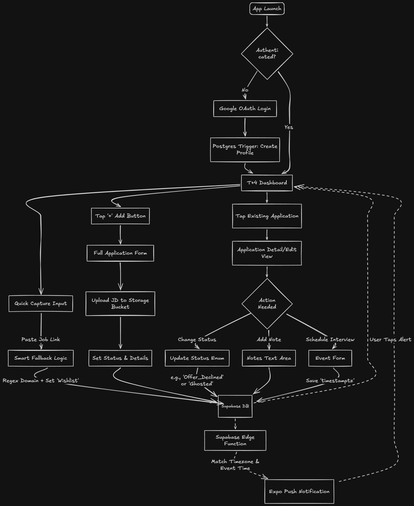

# System Architecture & Technical Flow

This document outlines the system architecture, database schema, and the fundamental design decisions that ensure Landed remains lightning-fast, highly flexible, and scalable.

## 1. System Flow & User Journey

The architecture is designed to support the user through four distinct phases of the job hunt, minimizing input friction while maximizing data utility.

### Visual Architecture Diagram

### Flow Breakdown

**Phase 1 (Discovery):** User pastes a URL. The frontend regex extracts the domain, creates a draft with the Wishlist status, and pushes it to Supabase instantly.

**Phase 2 (Action):** User manually adds a job, uploads a Job Description (JD) PDF to the Supabase Storage bucket, and sets the initial details.

**Phase 3 (Progression):** User updates statuses, logs contextual notes, and attaches chronological events (interviews, deadlines, start dates) to the application entity.

**Phase 4 (Automation):** Supabase Edge Functions periodically scan the events table. If an event is imminent based on the user's localized timezone, it triggers the Expo Push API to alert the user's device.

## 2. Database Schema (Supabase / PostgreSQL)

The backend relies on a highly normalized PostgreSQL database. All tables enforce strict Row Level Security (RLS) policies (`user_id = auth.uid()`) and utilize auto-updating timestamp triggers.

### Custom Enums

- `app_status`: Wishlist, Applied, Interviewing, Offered, Offer_Accepted, Offer_Declined, Rejected, Ghosted
- `event_type`: Interview, Assessment, Follow_Up, Deadline, Start_Date
- `event_status`: Upcoming, Done, Overdue

### Core Tables

#### 1. profiles (Managed via Auth Trigger)

- `id` (UUID, PK, ref: auth.users)
- `email` (Text)
- `full_name` (Text, Nullable)
- `expo_push_token` (Text, Nullable)
- `timezone` (Text, Default 'UTC')
- `created_at`, `updated_at` (Timestamptz)

#### 2. applications (The Anchor Entity)

- `id` (UUID, PK)
- `user_id` (UUID, FK to profiles, Cascade Delete)
- `company_name` (Text)
- `role_title` (Text, Nullable)
- `jd_url` (Text, Nullable)
- `jd_storage_path` (Text, Nullable)
- `status` (app_status, Default 'Wishlist')
- `created_at`, `updated_at` (Timestamptz)

#### 3. events (The Timeline Engine)

- `id` (UUID, PK)
- `application_id` (UUID, FK to applications, Cascade Delete)
- `type` (event_type)
- `title` (Text)
- `event_time` (Timestamptz)
- `status` (event_status, Default 'Upcoming')
- `created_at`, `updated_at` (Timestamptz)

#### 4. notes (Contextual Storage)

- `id` (UUID, PK)
- `application_id` (UUID, FK to applications, Cascade Delete)
- `event_id` (UUID, Nullable, FK to events)
- `content` (Text)
- `created_at`, `updated_at` (Timestamptz)

### Cloud Storage

- **Bucket:** job_descriptions (Private)
- **Structure:** user_id/filename.pdf
- **Access:** RLS policies restrict users to only access folders matching their `auth.uid()`.

## 3. Core Architectural Decisions & Edge Case Handling

- **The "Discovery Friction" Fallback:** We avoid forcing users to fill out complex forms when browsing. The "Quick Capture" UI accepts a raw URL, extracts the domain via regex to satisfy the company_name requirement, and queues it as a Wishlist draft.
- **Event-Driven Stages over Rigid Pipelines:** By completely separating events from the applications table, the system naturally supports a company with a single interview round just as easily as a company with seven, preventing schema bloat and UI rigidity.
- **The Optional Foreign Key Pattern (Notes):** The notes table uses a nullable event_id. This allows a single frontend query to fetch a unified, chronological timeline of all notes for an application, while utilizing Postgres's efficient Null Bitmap to ensure empty fields consume effectively zero physical storage.
- **Timezone Accuracy:** All event times are stored strictly as `timestamptz` and evaluated against the user's localized `profiles.timezone`. This guarantees that background Edge Functions trigger push notifications at the correct local time, regardless of the server's UTC configuration.
- **Accurate Success Metrics:** Splitting the final application stages into Offer_Accepted, Offer_Declined, and Rejected ensures that turning down a lowball offer is calculated as a pipeline success, not a failure, keeping dashboard analytics highly accurate.
- **Zero Schema Bloat for Edge-Case Dates:** Handling the Start_Date as an event rather than a dedicated application column keeps the primary table lean, while naturally integrating with the existing push notification pipeline.
